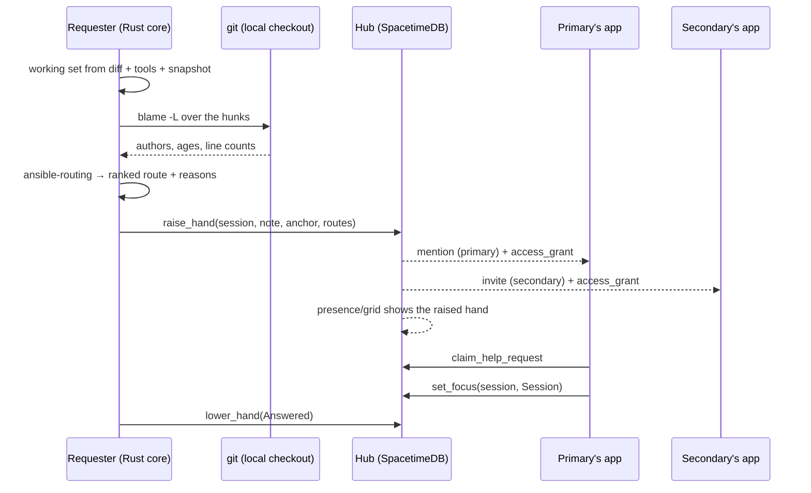

# Hand raise — asking for help, and routing it

Feature design. Not started; no code exists. Written to be argued with before
anyone builds it.

**Status:** proposed. Depends on Phase 1's grid, presence, and mentions. The
first slice ([§8](#8-what-to-build-first-and-the-kill-criterion)) is deliberately
small enough to run as a dogfood experiment before the interesting parts are
committed to.

## The feature in one paragraph

You are in a session, you are stuck, and you do not know who to ask. You raise
your hand. Your presence card in the grid changes to say so, so the state is
visible to the whole team rather than to whoever you happened to DM. Ansible then
works out *who* to ping: it takes the files this session is actually working in,
blames the lines being edited, maps commits back to teammates, and pings the
person whose work those lines are. It pings a **second** person too, chosen by a
different rule — someone who would benefit from watching the answer rather than
someone who knows it. Both land in the read-only session viewer, anchored at the
moment the hand went up.

---

## 1. Why this is not `AwaitingApproval`, and not a mention

The grid already carries two signals that look adjacent. Neither covers this one,
and the differences are what shape the design.

| Signal | Who is blocked | Who can unblock | Who decides the audience |
|---|---|---|---|
| `AwaitingApproval` | the **agent** | the session owner | nobody — it's a broadcast state |
| `@mention` | nobody necessarily | the named person | the **sender**, who must already know |
| **Hand raise** | the **human** | someone with context | the **system** |

`AwaitingApproval` is described in the plan as *"the interruption a teammate can
actually resolve, and the highest-value thing the grid can surface."* That is the
agent waiting on its owner. A raised hand is the inverse: the agent is often
perfectly happy — confidently doing the wrong thing, or three failed approaches
deep — and the *human* is the one who is stuck. There is no hook, no terminal
state, and no timer that reveals it. It only exists when someone says so.

Mentions already deliver "come look at this moment," and hand raise should reuse
that machinery wholesale ([§7](#7-code-shape)). What mentions cannot do is answer
*who*. The moment you are new, or the code is unfamiliar, or the owner has left,
the mention flow stalls on a question the system is much better placed to answer
than you are. **Hand raise adds a routing decision, not a delivery path.**

---

## 2. What a raised hand is, in the schema

**Decision: its own table. Not a `SessionStatus` variant, not a field on
`presence`.** Three reasons, in order of weight.

**`SessionStatus` describes the agent, and its provenance is enforced.** The
status enum is deliberately about what the agent is doing, and
`update_session_status` rejects statuses from the wrong `StatusSource` —
`AwaitingApproval` only from `Terminal`, `Failed` only from `Supervisor`. A
raised hand has a fifth source: a human clicking a button. Adding it to the enum
means the one field that carefully means "what the agent is doing" starts also
meaning "what the human wants", and the reducer's provenance check has nothing to
check.

**Presence is connection-scoped and deleted on disconnect.** That is exactly the
right semantics for "a human has this on screen" and exactly the wrong semantics
for a request for help: a hand that silently drops when you close the window
sends responders to a session with nothing happening on it, and one such arrival
is enough to teach the team that the badge is noise. The hand must outlive the
connection. Presence *renders* it; presence does not *hold* it. This is the same
split the plan makes between `session_listing` and `session` — a boundary, not a
view-model convenience.

**It has a lifecycle and participants that presence has nowhere to put** — open →
claimed → resolved, a primary, a secondary, and a reroute history.

### Tables

| Table | Key | Holds | Growth |
|---|---|---|---|
| `help_request` | auto id | session_id, requester, opened_at, note, `anchor`, `state`, claimed_by, claimed_at, resolved_at, `outcome` | O(open + recent), pruned |
| `help_route` | (request_id, identity) | `role`, rank, reason, notified_at, responded_at | ≤ small constant per request |

The fifth assumption in the plan — *nothing in SpacetimeDB may grow with
transcript volume* — holds here without effort: both tables are O(requests), and
requests are a human-rate event. `prune_help_history()` joins
`prune_status_history()` on the scheduled path so the one table that grows has a
retention policy from day one rather than after the first bill.

`anchor` is the same (chunk seq, byte offset) pair mentions use. A hand points at
a *moment* for the same reason a mention does: the responder should land where
you got stuck, not at the tail of a stream that has moved on.

### Enums

- `HelpState`: `Open` · `Claimed` · `Resolved` · `Expired` · `Withdrawn`
- `HelpRole`: `Primary` · `Secondary` · `Rerouted`
- `HelpOutcome`: `Answered` · `SelfResolved` · `NoResponse` · `Withdrawn`

`SelfResolved` is worth carrying separately from `Answered`. "I figured it out
while writing the note" is a real and common outcome, and collapsing it into
`Answered` would flatter the routing in exactly the measurement
([§8](#8-what-to-build-first-and-the-kill-criterion)) that is supposed to tell us
whether the routing works.

### Reducers

**Requester — agent connection** (the routes are computed locally in the Rust
core, so they arrive with the request):

- `raise_hand(session_id, note, anchor, routes) -> request_id` — owner-only for
  their own session; idempotent on `(session_id, Open)` so a double-click or a
  crash-restart does not open a second request.
- `lower_hand(request_id, outcome)` — requester or claimant.
- `reroute_help_request(request_id, to, reason)` — the "not me" action, available
  to a routed member. Records the original route rather than overwriting it;
  a reroute is the highest-signal training data the system will ever get and
  throwing it away to keep the table tidy would be a bad trade.

**Responder — viewer connection**

- `claim_help_request(request_id)` — first claim wins inside the transaction; a
  second claimant is rejected and shown who holds it. Without this the request
  has two failure modes and they are opposites: everybody piles in, or everybody
  assumes somebody else went.

**Scheduled**

- `expire_help_requests()` — unclaimed past the window → escalate
  ([open question 6](#9-open-questions)); session closed with a hand up →
  `Expired`.
- `prune_help_history()` — retention, as above.

### Row-level security

`help_request` and `help_route` reach the requester, the routed members, and —
when the session is shared with the org — the org. The `reason` string is the one
field that can carry file paths, so it is filtered with the row rather than
denormalized onto anything more widely visible ([§6](#6-where-it-runs-and-what-leaves-the-machine)).
The same two constraints Spike B found still apply: a filtered table must be
`public`, and RLS cannot compare an enum to a literal — so if `state` is ever
needed in a rule, it gets a boolean mirror beside it exactly as `visibility` did
with `shared_with_org`.

---

## 3. Routing, part one — what are we actually talking about?

Routing has two halves and they fail independently. First: which files is this
session working in? Call it the **working set**.

Four signals, best first. Each is independent of the ones below it, so any can be
missing without collapsing the answer:

| Signal | Source | Notes |
|---|---|---|
| **Uncommitted diff** | `git status --porcelain` + `git diff` in the session `cwd` | Strongest. Depends on nothing about Claude Code's payload shapes — it is literally what this session has changed. |
| **Tool file paths** | `PreToolUse` / `PostToolUse` `tool_input` | High value, **unverified**. See below. |
| **Terminal snapshot** | Spike A's `Snapshot` visible text | Catches paths printed in output — a failing test's file, a stack trace — that no tool call names. |
| **Prompt text** | `UserPromptSubmit.prompt` | Weak, but it is the only signal that exists before anything has been edited, which is a common moment to be stuck. |

The second row needs a caveat stated plainly, because it is the kind of thing
that quietly becomes an assumption: `ansible-hooks` models `tool_input` as an
opaque `serde_json::Value`, and **the only `tool_input` ever recorded from a real
session is Bash's** — `{"command": …, "description": …}`. Both fixtures in
`crates/ansible-hooks/tests/fixtures/` are Bash. The `file_path` key that Edit,
Write, and Read are assumed to carry has not been observed here. It is very
likely right and it is still an assumption; recording one session that edits a
file settles it in an afternoon ([open question 1](#9-open-questions)). Until
then, the working set leans on the diff, which needs no such assumption.

**Rank and cap the set.** Weight by recency (a short half-life — within a session,
the thing you touched last is the thing you are stuck on), by write-over-read
(an Edit means more than a Read), and by repeat touches. Then cut to roughly
eight files. A session that has read two hundred files must not produce a
two-hundred-file query: an over-broad working set diffuses the blame across the
whole repo and routes to whoever has committed most overall, which is
indistinguishable from not routing at all. **Precision beats recall here.**

**Blame the hunks, not the files.** Take the line ranges from the diff, not the
whole file. On a 900-line module where you changed twelve lines, whole-file blame
answers "who wrote this module" and hunk blame answers "who wrote the part you
are stuck on." `git blame -L <start>,<end>` per hunk, with a few lines of context
either side. This one choice probably does more for route quality than any
tuning of the weights.

---

## 4. Routing, part two — from blame to a person

Score each candidate as a sum over the working set:

```
score(person) = Σ_files  file_weight
              × Σ_lines_in_hunks  authored_by(person)
              × recency_decay(commit_age)       # half-life ~90 days
              × distinct_commit_bonus            # many small commits > one import
```

Recency decay matters more than it looks. Code churns, people move teams, and the
author of the original 2023 version of a file is usually not the person who knows
what it does today. Without decay the routing systematically pages the past.

The formula is the easy part. Everything below is where it actually goes wrong,
and all of it is measurable on this repo today.

### Blame does not identify people; it identifies commit authors

Measured on `mrshll/ansible` at `413555d` (11 commits):

| Observation | Value |
|---|---|
| Commits authored by `Claude <noreply@anthropic.com>` | **2 of 11** |
| Commits carrying a `Co-Authored-By: Claude …` trailer | **8 of 11** |
| Lines in `docs/plan/multiplayer-hub.md` blaming to `noreply@anthropic.com` | **377 of 520 (72%)** |
| Author emails in a `users.noreply.github.com` form | **0 of 3** |
| `.mailmap` present | no |

Read that third row again: a naive "most lines wins" route against the repo's own
architecture plan pings a language model. So:

**Bots are excluded structurally, not heuristically.** Route only to commit
identities that resolve to a `member` row. A candidate that resolves to nothing —
a bot, a contractor, someone who left — is *dropped*, never guessed at. This also
handles the departed-author case for free, which is otherwise its own special
case.

**Email → GitHub login is not parseable here.** The convenient case is
`12345+login@users.noreply.github.com`, which decodes locally with a regex. This
repo has none of those. The real mapping needs either the GitHub commits API
(`author.login` for a sha, cached per-commit and effectively permanent) or a
maintained `.mailmap`. That decision determines whether `ansible-routing` can run
fully offline, so it should be made before the crate is written
([open question 2](#9-open-questions)).

**Squash-merge repos attribute everything to the merger.** A repo whose commits
are overwhelmingly authored by a handful of people with merge-shaped subjects is
detectable, and the right response is to say so in the UI — "blame is
low-confidence in this repo" — rather than to route confidently on noise.

**In an agent codebase, blame increasingly means "who ran the session."** Eight of
eleven commits here were co-authored by a model. That person is still, arguably,
exactly the right person to ask: they prompted it, reviewed it, and shipped it.
But it makes the obvious copy — *"you wrote 62% of these lines"* — false, and the
whole reason the ping is trusted is that its stated reason is true. Say
"your commits touched" or "you shipped," which stays accurate either way.

**Blame quality is a function of history depth.** On this repo,
`crates/ansible-capture/src/redact.rs` blames 797 of 797 lines to a single
commit — blame here answers "who created the crate" and nothing finer. A young
repo, a freshly split module, and a vendored directory all degrade the same way,
which is why the fallback ladder is part of the design rather than an
afterthought.

### The fallback ladder

1. Hunk blame (above)
2. File blame
3. Directory blame — nearest ancestor with real history
4. `CODEOWNERS`, if the repo has one
5. Ansible's own signal (below)
6. **No primary — escalate to the org.** "Nobody obviously owns this, asking
   everyone" is an honest answer and a good outcome. Inventing a plausible name
   is worse than admitting the tool does not know.

### The signal git does not have

Ansible will know something blame cannot: **who has recently *worked in* these
files inside ansible sessions.** The working set of every session is computed by
the same machinery described in §3, and the hub already has a row per session.
Someone who spent two hours in `redact.rs` yesterday and has not committed yet is
invisible to blame and is very likely the best person to ask.

This is the strongest planned improvement to routing and it is deliberately *not*
in the first version, because it needs working sets published to the hub — which
is a real privacy decision (your file paths become team-visible whether or not
you ever raise a hand) and a row-budget question. It belongs in
[§8](#8-what-to-build-first-and-the-kill-criterion) phase 3, after the blame
version has established whether anyone raises hands at all.

### Eligibility, fairness, and load

- **Exclude:** the requester, non-members, removed members, bot identities.
- **Availability orders, it never filters.** `presence` and session status tell
  you who is on the grid versus heads-down in their own session, and that is a
  good tiebreak. It is a bad filter: hiding the one person who actually knows,
  because they look busy, produces a confidently wrong route. Show that they are
  busy and let the requester decide.
- **Long-absent members are deprioritized, not excluded** — no presence and no
  session in N days is a decent vacation proxy, but if they are the only
  candidate, the requester should be told they exist.
- **Cooldown and daily cap.** Without one, the person with the most blame becomes
  the team's pager and the feature's most-visible effect is burning out your best
  engineer. Among near-ties (within a few percent), prefer whoever has been
  pinged least recently. Load-balancing beats argmax.
- **Determinism.** Identical inputs must produce an identical route, ties broken
  on a stable key. Non-deterministic routing cannot be golden-tested, and
  [§7](#7-code-shape) turns on it being testable.

### Explainability is a requirement

Every route carries a one-line reason, rendered verbatim in the ping:

> Sam's commits account for 62% of the 31 lines being edited in
> `crates/ansible-capture/src/redact.rs`, most recently three weeks ago.

Two reasons this is load-bearing rather than polish. A wrong route becomes
*obviously* wrong at a glance, so nobody wastes ten minutes discovering it. And
it makes "not me → reroute" a cheap, well-informed click, which is the only
training signal this system will ever get about its own accuracy.

---

## 5. The secondary person, chosen by a different rule

The second slot is not a backup primary. If it were, it would be "second highest
score," and it would ping the second-most-overloaded expert. It is scored on a
different objective: **who would most benefit from being in the room, and can
follow along?**

```
learning_score(person) = adjacency(active in this repo / neighbouring dirs)
                       × (1 − ownership_of_these_exact_files)
                       × unfamiliarity(area)
                       × availability
                       ÷ recent_secondary_count      # round-robin
```

Note the middle term is *inverted* relative to the primary's. The primary is
chosen for owning these lines; the secondary is chosen for being close to the
area but not in it.

Why it earns a slot at all:

- **The answer gets explained rather than just applied.** Two people means the
  fix comes with reasoning attached. The conversation is happening anyway; the
  marginal cost of one more listener is near zero and the marginal value is the
  only actual knowledge transfer in the whole flow.
- **Bus factor becomes measurable.** "How many people have touched this area" is
  a number the routing already computes, and this is the one feature that moves
  it deliberately.
- **It de-privatizes the expert tax.** Help stops being a two-person favour
  negotiated in DMs and becomes something the team can see happening.

### Guardrails, because volunteering someone else's time is expensive

- **Invited, not paged.** In-app invite only — no Slack DM, no unread escalation,
  no follow-up. The primary's response time must never depend on the secondary
  showing up.
- **Never on a sensitive request**, and never when the primary is already the
  only member who can see the session.
- **Per-person opt-out**, plus a "not now" that is not a reroute and carries no
  implication.
- **Round-robin**, so it is not always the newest hire.
- **The reason string is about the area, never about the person.** "This touches
  the capture path, which you haven't worked in yet" — not "you're new."
- **Org-wide feature flag in `hub_config`.** This is the part of the feature most
  likely to be quietly disliked, and the honest response to that is to make it
  trivially switchable off and to measure whether secondaries actually join.

---

## 6. Where it runs, and what leaves the machine

**All routing computes locally, in the Rust core, on the requester's machine.**
Not in the hub, not in the Worker. Three reasons, and the third is the one that
matters:

1. The repo is only checked out there. The hub has no repository access and the
   Worker has none either; giving either one clone access to every team repo is a
   large new attack surface bought for a feature that does not need it.
2. Blame on a private repo needs no new credential, because the requester already
   has the checkout.
3. **The file names never leave the machine unless a hand actually goes up.**
   Working sets are computed continuously and discarded; only a deliberate act
   publishes anything.

State it as a property: **routing inputs are local; routing outputs are minimal.**
What crosses the wire is the request row, up to three member identities, and one
short reason string each. The reason string is the only field that can carry a
path — and a path can itself be a secret (`~/customers/acme/…`) — so it passes
through the same redaction ruleset `ansible-capture` already applies to bytes.
Reusing that ruleset rather than writing a second one is the whole point of it
being a pure function.

### Raising a hand on a private session

Assumption A4 makes transcripts private by default, which collides directly with
this feature: the private session is *exactly* where you are most likely to be
stuck, and the sessions people keep private are often the ones on unfamiliar
code.

| Option | Consequence |
|---|---|
| Block the hand until the session is shared | Simplest, and wrong. It makes asking for help cost an org-wide disclosure, so people will not ask. |
| Hand goes up, title only | The responder gets a page and nothing to look at, then has to ask you to share — a round trip added to the one flow whose entire value is latency. |
| **Grant the routed people access, and only them** ✅ | Recommended. |

The third option is what `access_grant` is for. The plan added that table on day
one *"even though Phase 1's org-wide sharing makes it mostly unused"*, on the
grounds that retrofitting authorization is miserable. This is its first real use:
the grant is scoped to the routed identities, created by the requester's explicit
act of raising a hand, and revoked when the request resolves. A reroute extends
the grant to the new person rather than widening it to the org.

Two things the UI must be honest about, both inherited from the plan's own
statement of the consent model: the requester sees exactly who is being granted
access *before* the hand goes up, and revoking on resolution does not recall
bytes already fetched. Also worth saying out loud in the same breath the plan
does: whoever holds the module publish credential bypasses RLS, so `Private`
separates teammates from each other, not from an admin.

---

## 7. Code shape



**New crate `crates/ansible-routing`, pure.** `(WorkingSet, BlameIndex, Roster,
Policy) → Route`. No git, no network, no hub, and no clock — time enters as a
parameter, exactly as it does in `ansible-capture`. The reasoning is the same
reasoning that crate's boundary rests on, applied to a different risk: routing is
a judgement about *people*, it will be tuned constantly, and every tuning change
needs to be checkable against recorded reality. So record real working sets and
blame indexes as fixtures and assert the resulting ranking, the way
`tests/fixture_replay.rs` replays recorded hook payloads.

**The git adapter lives in the app** (`apps/desktop/src-tauri/src/routing/`) and
owns all the I/O: `git status`, `git diff`, hunk extraction, `git blame -L`,
mailmap, and the commit → GitHub login cache. Keeping it out of the crate is what
keeps the crate testable.

**Delivery reuses mentions.** A `Primary` route creates a `mention` with the
anchor, which means `notification_route`, the Slack bridge, the
`ansible://session/{id}?at={anchor}` deep link, OS notification with the window
closed, and read receipts all work with no new code. There must not be a second
notification system.

**Cost.** Blaming all 94 tracked files in this repo takes 0.87 s cold — but this
repo has 11 commits, and blame cost scales with history depth, not file count.
Measure on a repo with real history before deciding whether the blame index is
computed on demand or maintained in the background. Either way the request row is
created *immediately* with routes empty and the routes land a moment later, which
is also the correct behaviour if blame fails outright: the hand goes up, the team
sees it, and the routing is an enhancement rather than a dependency.

---

## 8. What to build first, and the kill criterion

**Phase 0 — the hand, with no routing at all.** Raise, show it in presence and on
the grid tile, claim, resolve. The requester picks the person by hand, which the
mention flow already does. Dogfood for two weeks.

This phase exists to answer one question before any of the interesting work is
paid for: **do people raise hands?** Asking for help publicly is a cultural act
before it is a technical one, and a team that will not do it in a grid everyone
can see will not be rescued by better routing. If a team of ten raises fewer than
about one hand a week, the routing solves a problem nobody has, and the effort
belongs elsewhere. This is the cheapest kill criterion available and it comes
first.

**Phase 1 — working set, hunk blame, primary route.** With the reason string, the
reroute action, and an explicit measurement of *route accepted without reroute*.
Target a stated number (60% is a reasonable first bar) and measure it rather than
asserting it. A routing system nobody has measured is a routing system nobody
should trust.

**Phase 2 — the secondary slot**, behind the `hub_config` flag. Measured on two
things: does the secondary actually join, and do teams leave the flag on?

**Phase 3 — ansible's own working-set signal**, to beat blame at its own job
([§4](#4-routing-part-two--from-blame-to-a-person)).

---

## 9. Open questions

1. **Do `Edit` / `Write` / `Read` `tool_input` payloads carry the path key we
   assume?** The only recorded `tool_input` is Bash's. Decides whether the
   working set can lean on hooks or must lean entirely on `git status`. Cheapest
   question here — record one session that edits a file.
2. **What is the verified commit-email → GitHub-login path, and does it require
   network?** Decides whether `ansible-routing` and its adapter can work offline,
   and therefore whether raising a hand works on a plane. Ties to plan open
   question #3, which is still the last thing gating Phase 1.
3. **Is a hand per-session or per-person?** An engineer running four sessions
   across a laptop and a devbox (plan open question #8) — can two hands be up?
   Probably yes per-session, but the grid IA has to say so.
4. **Does raising a hand imply granting transcript access?**
   ([§6](#6-where-it-runs-and-what-leaves-the-machine)) A policy decision for the
   team, not an experiment — same category as plan open questions #4 and #5.
5. **Can a responder take over input?** A raised hand is the strongest argument
   yet that plan open question #9 eventually resolves to yes, and that decides
   whether the byte stream must be bidirectional from day one. Worth answering
   now rather than after the transport is frozen.
6. **What does escalation look like when nobody claims?** After N minutes: a
   Slack channel, the whole org, an on-call rotation? Needs the Slack bridge's
   channel model, which today only describes DMs.
7. **Does the secondary slot survive contact with a real team?** Social rather
   than technical, and measurable: join rate, and how many orgs turn the flag
   off.
8. **What wins on the tile when the agent is `AwaitingApproval` *and* a hand is
   up?** Probably the hand — it is the one a teammate can act on — but grid
   ordering needs stating rather than emerging from whatever the renderer does.
9. **Retention on `help_request`.** This table is a record of who needed help
   with what, which is sensitive in a way session rows are not. Who can read the
   history, and for how long? Ties to plan open question #5.

One structural note. Presence and mentions are meant to be reused for a second
plane (plan open question #7), and hand raise should key its rows the same way
they do. If `session` ever becomes a specialization of a generic `subject` with
presence and mentions keyed by `(plane, subject_id)`, hand raise should follow for
free — the routing inputs change (blame is repo-specific; another plane would
need its own notion of "who owns this") but the request, claim, resolve, primary,
and secondary machinery does not.
