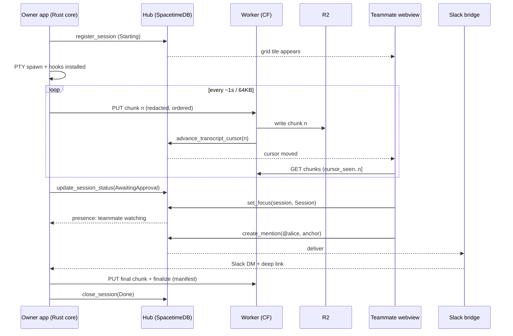

# ansible — multiplayer presence layer for Claude Code

Planning document. High-level architecture, schema surface, one end-to-end data
flow, two de-risking spikes, and the open questions that should be answered
before Phase 1 starts.

## Product in one paragraph

A desktop app where an engineering org launches Claude Code sessions in an
embedded terminal, sees a live grid of everyone's sessions and their status,
sees who is watching what, opens any teammate's session as a read-only live
transcript, and @mentions teammates against a specific moment in a session.
Agent sessions run locally under the user's own PTY and their own Claude
credentials; the app never calls a model API. Sessions are the first
"plane" — the presence, mention, and notification machinery is meant to be
reused for others (email is the named candidate).

---

## 0. Assumptions this plan rests on

Four decisions materially shape everything below. Each is a recommendation, not
a settled fact. Overturning one is cheap now and expensive after Phase 1.

| # | Decision | Chosen | If you choose otherwise |
|---|---|---|---|
| A1 | Transcript fidelity | **Both** raw PTY archive *and* a derived structured event index. Viewer defaults to structured, can drop into terminal replay. | Raw-only makes transcripts opaque blobs — no search, no grid status independent of hooks, no summarization, awkward reflow. Structured-only loses rendered diffs, spinners, and anything TUI-native, and makes you fully dependent on hook coverage. |
| A2 | Live-tail transport | **R2 cursor-follow at 1–3s**, with the viewer's chunk-source interface defined so a Durable Object relay can slot in later. | A relay from day one buys sub-second and costs you a second transport, connection lifecycle, and a reconnect/backfill seam to stitch between relay and archive. Cursor-follow has one path for both live and backfill — no seam. |
| A3 | Capture scope | **In-app launcher only** for Phase 1, with capture/registration factored as a local service the app happens to host. | Capturing *any* Claude Code session on the machine is a much better adoption story but you lose PTY ownership: you get hook events and little else, plus a daemon with its own lifecycle, auth, and update path. See open question #6 — this is the assumption most likely to be wrong. |
| A4 | Sharing default | **Org-visible by default**, with a redaction pass before bytes leave the machine, a private-session toggle, and pause/scrub controls. | Opt-in-per-session leaves the grid empty most of the time, which is the entire value prop. No-redaction is fastest and ends in durable secrets in R2. |

A fifth, less contentious one: **nothing in SpacetimeDB may grow with transcript
volume.** Row budget is O(sessions) + O(status transitions), both bounded. This
is a hard invariant, not a guideline, and it should be enforced in review.

---

## 1. Repo structure and module boundaries

Single monorepo. Four language/runtime targets (Tauri Rust core, React webview,
SpacetimeDB Rust module, Cloudflare Worker TS), so the layout is organized by
*deployment target* first and shared logic second.

```
ansible/
├─ apps/
│  └─ desktop/                     # the Tauri app
│     ├─ src-tauri/src/
│     │  ├─ commands/              # the entire Tauri IPC contract, one module per surface
│     │  ├─ terminal/              # host for the terminal crate: PTY lifecycle, focus, resize
│     │  ├─ session/               # supervisor + status state machine
│     │  ├─ capture/              # wires the capture crate to the uploader + local spool
│     │  ├─ hooks/                 # Claude Code hook install + localhost receiver
│     │  ├─ hub/                   # agent-role SpacetimeDB connection
│     │  └─ identity/              # GitHub OAuth, token storage in OS keychain
│     └─ src/                      # React webview
│        ├─ routes/                # grid · session · replay · settings
│        ├─ terminal/              # TerminalSurface component boundary (see below)
│        ├─ transcript/            # read-only viewer, ChunkSource, replay clock
│        ├─ hub/                   # generated SpacetimeDB bindings, viewer-role connection
│        └─ presence/
├─ services/
│  ├─ hub-module/                  # SpacetimeDB module — schema + reducers (source of truth)
│  ├─ transcript-worker/           # Cloudflare Worker + R2 binding; authz on read and write
│  └─ slack-bridge/                # mention → Slack DM delivery
├─ crates/
│  ├─ ansible-terminal/            # libghostty-rs wrapper. NO Tauri, NO hub dependency
│  ├─ ansible-capture/             # bytes in → redacted, ordered chunks out. Pure, golden-tested
│  ├─ ansible-hooks/               # hook payload types + status derivation, no I/O
│  └─ ansible-hub-client/          # typed SpacetimeDB client wrapper (app + integration tests)
├─ packages/
│  └─ protocol/                    # wire types SpacetimeDB does NOT own: chunk envelope,
│                                  # hook event, manifest, deep-link format
└─ docs/{plan,adr}/
```

### The boundaries that matter

Four rules carry most of the architectural weight. Everything else is
organization.

**`crates/ansible-terminal` depends on neither Tauri nor the hub.** It must
build and run as a standalone binary. This is what makes Spike A runnable in
isolation and what makes the xterm.js fallback a configuration change rather
than a rewrite.

**`crates/ansible-capture` does not depend on the terminal crate.** It is a pure
function of `(bytes, config) → ordered chunks`, which means it can be tested
with golden files and fuzzed. Capture correctness is the one thing in this
system with no acceptable failure mode, so it gets the strictest boundary.

**`TerminalSurface` is the terminal component boundary**, with two
implementations behind one interface:

```ts
interface TerminalSurface {
  sessionId: string
  mode: 'interactive' | 'replay'
  source: PtyHandle | ChunkSource
}
// GhosttySurface — native/offscreen libghostty render
// XtermSurface   — xterm.js fallback
```

The read-only teammate viewer is the *same component* in `replay` mode fed by a
`ChunkSource` instead of a PTY. Owner view and teammate view are one code path
with two sources — that is what makes feature #4 nearly free once #1 works.

**`ChunkSource` is the live-tail boundary.** `CursorFollowSource` (Phase 1)
polls R2 as the SpacetimeDB cursor advances; a future `RelaySource` subscribes
to a Durable Object. The viewer cannot tell the difference. This is the seam
that makes A2 reversible.

### Two SpacetimeDB connections, not one

The non-obvious call: the Rust core and the webview each hold their own
connection under the same GitHub-derived identity, with different roles.

- **Agent connection** (Rust core) writes session lifecycle, status, and
  heartbeats. Subscribes narrowly: its own sessions, plus mentions addressed to
  this user (so OS notifications work with the window closed).
- **Viewer connection** (webview) writes presence and mentions. Subscribes to
  the org grid.

This looks like duplication and isn't. Presence should be bound to the
*viewer* connection, because presence means "a human has this on screen." Close
the window and presence correctly drops while the session stays live and keeps
streaming. One shared connection would force you to choose between those two
meanings. SpacetimeDB's `client_connected` / `client_disconnected` lifecycle
then gives you presence cleanup for free, which is the only reason presence can
be trusted.

---

## 2. SpacetimeDB schema and reducer surface

The module is the schema source of truth; TS bindings are generated from it
(`spacetime generate`). Names below are the intended public surface, not code.

### Tables

| Table | Key | Holds | Growth |
|---|---|---|---|
| `member` | `identity` | github_login/id, display_name, avatar_url, role, joined_at, last_seen | O(team) |
| `session` | `session_id` | owner, host_label, repo, branch, title, `status`, status_detail, model_label, started_at, last_event_at, ended_at, exit_reason, `visibility`, transcript_key, **chunk_cursor**, **byte_cursor**, event_count | O(sessions) |
| `session_status_history` | auto id | session_id, status, at — **transitions only** | O(transitions), pruned |
| `presence` | `connection_id` | identity, session_id (`None` = on the grid), `focus`, since | O(live viewers) |
| `mention` | auto id | session_id, from, to, body, `anchor`, created_at, read_at, delivered_at | O(mentions) |
| `notification_route` | `identity` | slack_user_id, dm_channel, per-event prefs, enabled | O(team) |
| `access_grant` | (session_id, subject) | level, granted_by, at | O(grants) |
| `hub_config` | singleton | github_org, worker_base_url, schema_version, feature flags | 1 |

`access_grant` exists from day one even though A4 makes it mostly unused.
Retrofitting authorization onto a live system is miserable; an unused table is
free.

`status_detail` is a short human string ("awaiting approval: Bash") that the
grid renders verbatim. Resist making it structured until you know what the hooks
actually give you (Spike B).

### Enums

- `SessionStatus`: `Starting` · `Working` · `AwaitingInput` · `AwaitingApproval`
  · `Idle` · `Done` · `Failed` · `Detached`
- `Visibility`: `Org` · `Private` · `Granted`
- `Focus`: `Grid` · `Session` · `Replay`

Splitting `AwaitingApproval` from `AwaitingInput` is deliberate and worth a
whole status: approval is the interruption a teammate can actually resolve, and
it's the highest-value thing the grid can surface.

### Reducers, grouped by caller

**Lifecycle — agent connection (Rust core)**
- `register_session(...)` — upsert, **idempotent on session_id** so a crash-restart re-attaches instead of duplicating.
- `update_session_status(session_id, status, detail)` — owner-checked; writes a history row only on transition. Hottest reducer in the system; must tolerate being called far more often than it changes anything.
- `set_session_title(session_id, title)` — once the first prompt lands.
- `heartbeat_session(session_id)` — liveness.
- `close_session(session_id, exit_reason)` — final status, ended_at, final cursor.

**Archive — called by the Worker, never the app**
- `advance_transcript_cursor(session_id, chunk_cursor, byte_cursor, event_count)` — strictly monotonic; rejects any value ≤ current. This single field is the live-tail signal every viewer follows. Keeping it Worker-only is what makes the cursor mean "durably in R2" rather than "a client claimed so."

**Presence — viewer connection (webview)**
- `set_focus(session_id: Option<String>, focus)` · `clear_focus()`
- `client_connected` / `client_disconnected` — the latter deletes this connection's presence rows.

**Mentions**
- `create_mention(session_id, to, body, anchor)` — validates the sender can see the session.
- `mark_mention_read(id)` · `mark_mention_delivered(id, channel)` (Slack bridge).

**Membership**
- `upsert_member_from_token()` — reads *verified* claims, never client-asserted login. See open question #3: the trust path from GitHub OAuth to SpacetimeDB `Identity` is unresolved and it decides whether the Worker must intermediate all writes.
- `admin_set_role(identity, role)` · `remove_member(identity)`

**Scheduled**
- `reap_stale_sessions()` — ~60s; stale heartbeat and no live agent connection → `Detached`.
- `prune_status_history()` — enforce retention on the one table that grows.

### Row-level security

Use `#[client_visibility_filter]` RLS so `Private` sessions never reach
non-owners and `mention` rows reach only sender and recipient. **Verify RLS
support and expressiveness on Maincloud early** — if the rules can't be
expressed there, reads must be funneled through a filtering intermediary and
the architecture shifts noticeably. This is a correctness dependency, not a
nicety.

---

## 3. One session lifecycle, end to end



**1 — Launch.** User picks repo/branch in the grid. `spawn_session` allocates a
session id, writes a session-scoped Claude Code settings overlay whose hooks
point at a localhost receiver with a per-session bearer token, forks a PTY
running `claude`, attaches the terminal for interactive render and the capture
tee to the PTY read side.

**2 — Register.** `register_session` fires *before the first byte*, so the grid
shows a `Starting` tile within one round trip and there is a row for the cursor
to attach to. Ordering matters here: a cursor bump for an unregistered session
is an error case you don't want to design around.

**3 — Stream.** Three independent streams leave one session:

- *Bytes* → ring buffer → redaction → chunker (flush at ~64KB or ~1s, whichever
  first) → `PUT /s/{id}/chunks/{n}` → Worker checks the caller owns the session
  and that `n` is the expected next → writes `r2://transcripts/{id}/{n}.jsonl.zst`
  → `advance_transcript_cursor`. The envelope carries seq, byte range, wall-clock
  span, and per-record timing deltas so replay is time-accurate rather than
  dumped all at once.
- *Status* — hooks (`UserPromptSubmit`, `PreToolUse`, `PostToolUse`,
  `Notification`, `Stop`, `SessionEnd`) → localhost receiver → status machine
  collapses to a coarse status plus short detail → `update_session_status` on
  change only, debounced. Hooks give semantics the bytes cannot: "awaiting
  approval for Bash" versus "thinking."
- *Structured events* — the same hook payloads plus Claude Code's own session
  JSONL, folded into the event index and uploaded on the same chunk path under
  an `events/` prefix. This is what the default viewer renders and what makes
  search possible later.

Backpressure: uploads are a bounded queue; on Worker failure, retry with
backoff and keep buffering to a local spool file. The cursor simply stops
advancing and viewers see "live tail stalled." Never drop-and-continue — order
is the one invariant, and a visible stall is strictly better than a silent gap.

**4 — Viewed by a teammate.** B's tile flips to `Working`. Opening it calls
`set_focus`, and A immediately sees B's avatar on the session — presence is
symmetric, instant, and pure SpacetimeDB, which makes it the cheapest
"multiplayer" signal in the system. B's viewer subscribes to that one `session`
row, reads `chunk_cursor`, fetches `(seen..cursor]` from the Worker (which
re-checks authorization and either streams from R2 or issues a short-lived
signed URL), and feeds a replay-mode `TerminalSurface`. As the cursor advances,
the subscription fires and the viewer fetches the delta. **Backfill and live
tail are the identical path**, which is the main argument for cursor-follow: a
teammate joining at minute 30 and one watching from minute 0 run the same code.

**5 — Mention.** B types `@alice take this one` in the session side rail →
`create_mention` with an anchor (chunk seq + byte offset — this is why the
envelope needs offsets; a mention has to point at a *moment*, not a session).
Alice's agent connection receives it and raises an OS notification even with
the window closed. In parallel the Slack bridge posts a DM with
`ansible://session/{id}?at={anchor}` plus a web fallback. Clicking focuses the
app, opens the viewer at the anchored offset, and calls `mark_mention_read`.

**6 — Close.** `SessionEnd` or PTY EOF → capture flushes the tail chunk →
Worker writes it, bumps the cursor, then `finalize` writes
`manifest.json` (chunk count, total bytes, time span, redaction ruleset
version, event index offsets) → `close_session`. The tile moves to a "recent"
band. Later replays read the manifest first and never touch SpacetimeDB beyond
the session row.

**Crash path, designed in from day one** because it will happen constantly
during development: no `SessionEnd`, no EOF. `reap_stale_sessions` flips the
session to `Detached` after the heartbeat window. The local spool lets the app
re-upload the tail on next launch and finalize late.

---

## 4. Two de-risking spikes

Disjoint code, independent questions — run them in parallel.

### Spike A — libghostty-rs render + input inside Tauri (2–3 days)

The real unknown is not "does ghostty render." It is **how a GPU-rendered
surface coexists with a webview, and who owns input focus.** Three candidate
models; the spike picks one:

1. **Native child surface** (NSView / HWND / GTK child) layered over the webview
   at a rect the webview reports. Best fidelity and perf; worst integration —
   z-order, resize sync, hit-testing, rounded corners, and it breaks the moment
   the webview scrolls.
2. **Offscreen render → texture into the webview** via shared memory and
   canvas/WebGL. Composites cleanly and behaves uniformly across platforms; costs
   a per-frame copy and added latency.
3. **libghostty as VT state machine only** — parse and grid model, no GPU —
   with diffed cells sent to a webview renderer. Gives up ghostty's renderer but
   keeps its VT correctness, and is a strictly better xterm.js than xterm.js.

**Success criteria:** a real interactive `claude` session; correct rendering of
its TUI (box drawing, truecolor, input box, streaming output); keyboard input
with modifiers, paste, and Ctrl-C; resize → SIGWINCH → correct reflow; IME at
least not broken. Measured: input-to-glyph latency, CPU under heavy output
(pipe a large build log), memory. Plus the unglamorous question — does it build
on all three targets, and what does libghostty-rs actually expose today? It is
young, and its API surface and platform coverage are the substantive risk.

**Deliverable:** standalone binary in `crates/ansible-terminal` plus a Tauri
harness, an ADR naming the compositing model, and `TerminalSurface` frozen.

**Kill criterion:** if no approach clears the latency and stability bar in three
days, ship xterm.js for Phase 1. The component boundary makes that a config
change — *which is the actual point of running this spike first.*

### Spike B — real session round-tripped through SpacetimeDB + R2 (2–3 days)

No UI polish, no auth beyond a hardcoded token, no libghostty (use
`portable-pty`). Spawn `claude` under a PTY, tee bytes, install the hook set,
run a genuinely long task with real tool approvals, chunk and upload through a
deployed Worker into real R2, bump the cursor in a deployed Maincloud module,
and have a **second process** subscribe and reconstruct the stream.

**Success criteria:**
- **Byte-exact reconstruction** from R2 chunks versus a local reference capture. This becomes the golden test that protects the capture path forever.
- **Perceived latency:** p50/p95 from "bytes hit the PTY" to "second viewer renders." Target p95 < 3s.
- **Hook coverage:** does the status machine correctly identify awaiting-approval / working / idle / done on a real session, and which transitions are ambiguous or missing? This is the finding most likely to change the schema.
- **Cost at team scale:** chunks and bytes per session, R2 ops/month, reducer call rate for ~10 engineers × N sessions/day. Cheap to compute once, and it decides whether the chunking parameters are right.
- **Failure injection:** kill the Worker mid-session, kill the app mid-session, kill the network. Verify no gaps and no reordering after recovery.

**Deliverable:** `crates/ansible-capture` with the golden round-trip test, a
deployed module and Worker, a measurements writeup, and a first redaction
ruleset derived from what actually appeared in real output.

**Kill criteria:** byte-exactness or ordering can't be guaranteed under failure
injection → the chunk protocol needs rework before Phase 1. Or p95 > ~8s →
cursor-follow is insufficient and the relay moves into Phase 1.

---

## 5. Open questions before Phase 1, ranked by design impact

1. **Is libghostty-rs embeddable in a Tauri webview today, and under which
   compositing model?** Changes the entire terminal layer and possibly the
   choice of Tauri. If only the native-child-surface model works, UI design is
   constrained hard — no panels overlapping the terminal, awkward resize — and a
   native shell for the session view starts to look better than a webview.
   → Spike A.

2. **Do hooks plus session JSONL yield a status signal good enough to drive the
   grid?** The grid *is* the product. If `AwaitingInput` can't be detected
   reliably you fall back to inferring from byte patterns and idle timers, which
   is fragile and pushes semantics back into the capture path. → Spike B.

3. **What is the verified path from GitHub OAuth to SpacetimeDB `Identity`, and
   can RLS express the visibility rules?** Determines whether the Worker becomes
   a mandatory trusted intermediary for *all* writes (much more Worker, much less
   direct-to-SpacetimeDB), and whether `Private` is genuinely enforceable or
   merely cosmetic.

4. **Who owns redaction, and what is the failure mode when a rule misses?**
   Client-side-only means a missed secret is durable in R2 and org-readable.
   Worker-side scanning adds a second line at the cost of hot-path latency. The
   answer also decides whether you need a scrub path — which R2 makes easy and
   the cursor model makes awkward, since rewriting a chunk breaks byte-exactness.

5. **Retention and deletion policy.** How long do transcripts live, can an
   author delete one, and what is the exposure when agents touch production or
   customer data? Determines whether chunks are immutable and whether the cursor
   may ever move backward.

6. **Will people actually launch sessions in the app?** If not, the
   capture-anything daemon becomes Phase 1 rather than Phase 3, and that inverts
   the capture design because you lose PTY ownership. Worth answering with a
   one-week team trial of a stub before committing to launcher-only (A3).

7. **What is the second plane, concretely?** It decides whether `session`
   becomes a specialization of a generic `subject`, with presence and mentions
   keyed by `(plane, subject_id)`. Generalizing that far now costs almost
   nothing; retrofitting costs a migration. Generalizing *before* you know the
   second plane is the classic trap — so the question is worth answering, and
   the answer is worth acting on only if it's specific.

8. **Multi-machine, multi-session.** One engineer running four sessions across a
   laptop and a devbox: does the grid group by person, repo, or session? Adds a
   host/agent entity and shapes the grid IA, but not deeply.

9. **Can a viewer ever write?** Read-only is the stated scope, but the mention
   flow strongly implies "…and then take over." Input handoff brings input
   authority, conflict, and audit with it. Knowing whether it is on the roadmap
   decides whether the byte stream needs to be bidirectional from day one.

10. **SpacetimeDB Maincloud operational fit.** Schema migration story, backup,
    graceful degradation to local-only during an outage, cost at this scale. Low
    design impact, high project risk.

Questions 1–3 are spike or investigation work and should gate Phase 1.
Questions 4–5 need a policy decision from the team, not an experiment. Questions
6–10 can be answered during Phase 1 without stalling it.
