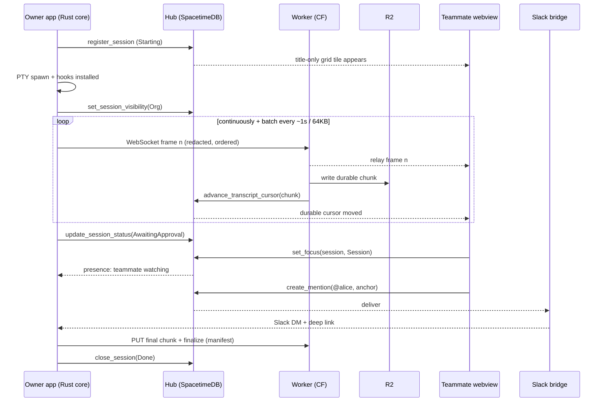

# ansible — multiplayer presence layer for Claude Code

Planning document. High-level architecture, schema surface, one end-to-end data
flow, two de-risking spikes, and the open questions that should be answered
before Phase 1 starts.

## Product in one paragraph

A desktop app where an engineering org launches Claude Code sessions in an
embedded terminal, sees a live grid of everyone's sessions and their status,
sees who is watching what, opens any teammate's session as a read-only live
transcript, and @mentions teammates against a specific moment in a session.
Agent sessions run locally under the user's own PTY and their own Claude
credentials; the app never calls a model API. Sessions are the first
"plane" — the presence, mention, and notification machinery is meant to be
reused for others (email is the named candidate).

---

## 0. Assumptions this plan rests on

Four decisions materially shape everything below. Each is a recommendation, not
a settled fact. Overturning one is cheap now and expensive after Phase 1.

| # | Decision | Chosen | If you choose otherwise |
|---|---|---|---|
| A1 | Transcript fidelity | **Both** raw PTY archive *and* a derived structured event index. Viewer defaults to structured, can drop into terminal replay. | Raw-only makes transcripts opaque blobs — no search, no grid status independent of hooks, no summarization, awkward reflow. Structured-only loses rendered diffs, spinners, and anything TUI-native, and makes you fully dependent on hook coverage. |
| A2 | Live-tail transport | **Settled by Spike B: keep the relay** ([ADR 0002](../adr/0002-live-tail-transport.md)). A Worker-hosted Durable Object relay carries ephemeral frames; every byte is also chunked to R2 and followed by the cursor, behind one `ChunkSource`. | Cursor-follow alone was measured at p95 1.3–1.6 s *on loopback* against the relay's 3 ms, and is worst on sparse output — which is what a session awaiting approval looks like. It is slowest precisely when the grid must be fastest, so it stays as the backfill and recovery path only. See [deployed-round-trip.md §4](../spikes/deployed-round-trip.md). |
| A3 | Capture scope | **In-app launcher only** for Phase 1, with capture/registration factored as a local service the app happens to host. | Capturing *any* Claude Code session on the machine is a much better adoption story but you lose PTY ownership: you get hook events and little else, plus a daemon with its own lifecycle, auth, and update path. See open question #6 — this is the assumption most likely to be wrong. |
| A4 | Sharing default | **Transcript-private by default; the owner explicitly toggles sharing.** Every session can still publish a title-only directory card and presence, but output stays in the local spool until shared. Sharing uploads the session so far and then starts its live relay. | Org-visible-by-default creates a fuller grid, but violates the requested consent model and risks sending sensitive output before the owner notices. Uploading private bytes with access controls is operationally simpler, but turns an authorization bug into a disclosure. |

Phase 1 targets **macOS and Linux**, not Windows. That adds CI, packaging,
keychain/secret-service, PTY, desktop notification, deep-link, and native-surface
variants. Most PTY and Tauri code remains shared; terminal embedding is the
largest platform-specific uncertainty and is why Spike A must prove both
targets. A macOS-only first release remains the fallback if Linux doubles the
terminal-integration work rather than adding a bounded adapter.

A fifth, less contentious one: **nothing in SpacetimeDB may grow with transcript
volume.** Row budget is O(sessions) + O(status transitions), both bounded. This
is a hard invariant, not a guideline, and it should be enforced in review.

---

## 1. Repo structure and module boundaries

Single monorepo. Four language/runtime targets (Tauri Rust core, React webview,
SpacetimeDB Rust module, Cloudflare Worker TS), so the layout is organized by
*deployment target* first and shared logic second.

```
ansible/
├─ apps/
│  └─ desktop/                     # the Tauri app
│     ├─ src-tauri/src/
│     │  ├─ commands/              # the entire Tauri IPC contract, one module per surface
│     │  ├─ terminal/              # host for the terminal crate: PTY lifecycle, focus, resize
│     │  ├─ session/               # supervisor + status state machine
│     │  ├─ capture/              # wires the capture crate to the uploader + local spool
│     │  ├─ hooks/                 # Claude Code hook install + localhost receiver
│     │  ├─ hub/                   # agent-role SpacetimeDB connection
│     │  └─ identity/              # GitHub OAuth, token storage in OS keychain
│     └─ src/                      # React webview
│        ├─ routes/                # grid · session · replay · settings
│        ├─ terminal/              # TerminalSurface component boundary (see below)
│        ├─ transcript/            # read-only viewer, ChunkSource, replay clock
│        ├─ hub/                   # generated SpacetimeDB bindings, viewer-role connection
│        └─ presence/
├─ services/
│  ├─ hub-module/                  # SpacetimeDB module — schema + reducers (source of truth)
│  ├─ transcript-worker/           # Cloudflare Worker + R2 binding; authz on read and write
│  └─ slack-bridge/                # mention → Slack DM delivery
├─ crates/
│  ├─ ansible-terminal/            # libghostty-rs wrapper. NO Tauri, NO hub dependency
│  ├─ ansible-capture/             # bytes in → redacted, ordered chunks out. Pure, golden-tested
│  ├─ ansible-hooks/               # hook payload types + status derivation, no I/O
│  ├─ ansible-transport/           # publishes chunks to the Worker; rebuilds them on the far side
│  └─ ansible-hub-client/          # typed SpacetimeDB client wrapper (app + integration tests)
├─ packages/
│  └─ protocol/                    # wire types SpacetimeDB does NOT own: chunk envelope,
│                                  # hook event, manifest, deep-link format
└─ docs/{plan,adr}/
```

### The boundaries that matter

Four rules carry most of the architectural weight. Everything else is
organization.

**`crates/ansible-terminal` depends on neither Tauri nor the hub.** It must
build and run as a standalone binary. This is what makes Spike A runnable in
isolation and what makes the xterm.js fallback a configuration change rather
than a rewrite.

**`crates/ansible-capture` does not depend on the terminal crate.** It is a pure
function of `(bytes, config) → ordered chunks`, which means it can be tested
with golden files and fuzzed. Capture correctness is the one thing in this
system with no acceptable failure mode, so it gets the strictest boundary.

**`TerminalSurface` is the terminal component boundary**, with two
implementations behind one interface:

```ts
interface TerminalSurface {
  sessionId: string
  mode: 'interactive' | 'replay'
  source: PtyHandle | ChunkSource
}
// GhosttySurface — native/offscreen libghostty render
// XtermSurface   — xterm.js fallback
```

The read-only teammate viewer is the *same component* in `replay` mode fed by a
`ChunkSource` instead of a PTY. Owner view and teammate view are one code path
with two sources — that is what makes feature #4 nearly free once #1 works.

**`ChunkSource` is the live-tail boundary.** `RelaySource` consumes ephemeral
frames over a Durable Object WebSocket; `CursorFollowSource` retrieves durable
chunks as the SpacetimeDB cursor advances. `LiveChunkSource` joins them: it
backfills through the cursor, tails the relay, and falls back to cursor-follow after
a disconnect. The viewer cannot tell which path supplied a frame.

One correction from Spike B, which built this join in
`crates/ansible-transport`: it **cannot deduplicate by sequence**. Frames and chunks
are not two views of the same units — a frame is an arbitrary byte range, a chunk is
a sequence, and a frame can deliver half of a chunk that arrives whole a moment
later. The join instead tracks a single `received_through` byte offset and splices
every message by absolute offset, which makes "already have it", "take only the new
tail", and "this would leave a gap" fall out as three cases of one comparison rather
than three special cases.

### Two SpacetimeDB connections, not one

The non-obvious call: the Rust core and the webview each hold their own
connection under the same GitHub-derived identity, with different roles.

- **Agent connection** (Rust core) writes session lifecycle, status, and
  heartbeats. Subscribes narrowly: its own sessions, plus mentions addressed to
  this user (so OS notifications work with the window closed).
- **Viewer connection** (webview) writes presence and mentions. Subscribes to
  the org grid.

This looks like duplication and isn't. Presence should be bound to the
*viewer* connection, because presence means "a human has this on screen." Close
the window and presence correctly drops while the session stays live and keeps
streaming. One shared connection would force you to choose between those two
meanings. SpacetimeDB's `client_connected` / `client_disconnected` lifecycle
then gives you presence cleanup for free, which is the only reason presence can
be trusted.

---

## 2. SpacetimeDB schema and reducer surface

The module is the schema source of truth; TS bindings are generated from it
(`spacetime generate`). Names below are the intended public surface, not code.

### Tables

| Table | Key | Holds | Growth |
|---|---|---|---|
| `member` | `identity` | github_login/id, display_name, avatar_url, role, joined_at, last_seen | O(team) |
| `session_listing` | `session_id` | owner, title, coarse status, started_at, ended_at — the title-only org directory card that exists even while output is private | O(sessions) |
| `session` | `session_id` | owner, host_label, repo, branch, status detail, model_label, last_event_at, exit_reason, `visibility`, **`shared_with_org`**, transcript_key, **chunk_cursor**, **byte_cursor**, event_count | O(sessions) |
| `session_status_history` | auto id | session_id, status, at — **transitions only** | O(transitions), pruned |
| `presence` | `connection_id` | identity, session_id (`None` = on the grid), `focus`, since | O(live viewers) |
| `mention` | auto id | session_id, from, to, body, `anchor`, created_at, read_at, delivered_at | O(mentions) |
| `notification_route` | `identity` | slack_user_id, dm_channel, per-event prefs, enabled | O(team) |
| `access_grant` | (session_id, subject) | level, granted_by, at | O(grants) |
| `hub_config` | singleton | github_org, worker_base_url, schema_version, feature flags | 1 |

Splitting `session_listing` from `session` is an authorization boundary, not a
view-model convenience. It prevents accidental field leakage when a private
session must remain discoverable for title-only presence. The listing's coarse
status should reveal only lifecycle (`Active` or `Done`), not whether a private
agent is awaiting approval or input.

`access_grant` exists from day one even though Phase 1's org-wide sharing makes
it mostly unused.
Retrofitting authorization onto a live system is miserable; an unused table is
free.

`status_detail` is a short human string ("awaiting approval: Bash") that the
grid renders verbatim. Resist making it structured until you know what the hooks
actually give you (Spike B).

`shared_with_org` is a redundant boolean mirror of `visibility == Org`, and exists
because **RLS cannot compare an enum column to a literal** — Maincloud rejects
`WHERE visibility = 'Org'` outright. The most important visibility rule in the
system is therefore keyed on the boolean. Both fields are written by
`set_session_visibility` in one transaction; nothing else may write either.

### Enums

- `SessionStatus`: `Starting` · `Working` · `AwaitingInput` · `AwaitingApproval`
  · `Done` · `Failed` · `Detached`
- `Visibility`: `Org` · `Private` · `Granted`
- `Focus`: `Grid` · `Session` · `Replay`
- `StatusSource`: `Hook` · `Terminal` · `Supervisor` · `Reaper`

`Idle` was dropped: Spike B found nothing can set it. `Stop` gives `AwaitingInput`,
and idle is that state plus elapsed time, which the viewer derives from
`last_event_at`. Carrying a status no producer can set is worse than not having it.

`StatusSource` exists because the statuses have non-interchangeable sources, and the
reducer enforces it: `AwaitingApproval` may only come from `Terminal` (hooks cannot
distinguish it from a slow tool) and `Failed` only from `Supervisor`
(`SessionEnd.reason` was `"other"` on a clean exit).

Splitting `AwaitingApproval` from `AwaitingInput` is deliberate and worth a
whole status: approval is the interruption a teammate can actually resolve, and
it's the highest-value thing the grid can surface.

### Reducers, grouped by caller

**Lifecycle — agent connection (Rust core)**
- `register_session(...)` — atomically creates the title-only listing and private detail row; idempotent on `session_id` so a crash-restart re-attaches instead of duplicating.
- `set_session_visibility(session_id, visibility)` — owner-only opt-in/opt-out; revokes new relay/archive reads immediately when made private.
- `update_session_status(session_id, status, detail, source)` — owner-checked; writes a history row only on transition. Hottest reducer in the system; must tolerate being called far more often than it changes anything. Rejects `AwaitingApproval` from any `source` but `Terminal`, and `Failed` from any but `Supervisor`, so the hook path cannot ship a guess.
- `set_session_title(session_id, title)` — once the first prompt lands.
- `heartbeat_session(session_id)` — liveness.
- `close_session(session_id, exit_reason)` — final status, ended_at, final cursor.

**Archive — called by the Worker, never the app**
- `advance_transcript_cursor(session_id, chunk_cursor, byte_cursor, event_count)` — strictly monotonic; rejects any value ≤ current. This single field is the live-tail signal every viewer follows. Keeping it Worker-only is what makes the cursor mean "durably in R2" rather than "a client claimed so."
- "Worker-only" is mechanical, not a convention: the caller must equal `hub_config.worker_identity`, and a hub with none configured refuses cursors outright rather than trusting whoever asked. `set_worker_identity(identity)` is admin-only and deliberately separate from `set_hub_config`, so granting the cursor-writing capability is its own audited act.

**Presence — viewer connection (webview)**
- `set_focus(session_id: Option<String>, focus)` · `clear_focus()`
- `client_connected` / `client_disconnected` — the latter deletes this connection's presence rows.

**Mentions**
- `create_mention(session_id, to, body, anchor)` — validates the sender can see the session.
- `mark_mention_read(id)` · `mark_mention_delivered(id, channel)` (Slack bridge).

**Membership**
- `upsert_member_from_token()` — reads *verified* claims, never client-asserted login. See open question #3: the trust path from GitHub OAuth to SpacetimeDB `Identity` is unresolved and it decides whether the Worker must intermediate all writes.
- `admin_set_role(identity, role)` · `remove_member(identity)`

**Scheduled**
- `reap_stale_sessions()` — ~60s; stale heartbeat and no live agent connection → `Detached`.
- `prune_status_history()` — enforce retention on the one table that grows.

### Row-level security

Use `#[client_visibility_filter]` RLS so only `session_listing` reaches the org
for private sessions, while `session` reaches the owner and authorized viewers;
`mention` rows reach only sender and recipient.

**Verified on deployed Maincloud by Spike B: the rules are enforced**, per-row and
per-identity, so reads do *not* need a filtering intermediary
([ADR 0003](../adr/0003-read-authorization.md)). Note that the 2.7.0
bindings claim the opposite (`// TODO: RLS filters are currently unimplemented, and
are not enforced.`) and that comment is stale; `scripts/probe-rls.sh` is the standing
evidence, asserted from the viewpoint of an identity that owns nothing. Three
constraints shape the schema around it:

- **A filtered table must be `public`.** RLS on a `private` table is a publish-time
  error, so `public` means "subscribable, then filtered", not "world-readable".
- **No enum-to-literal comparison** — hence `shared_with_org`, above.
- **The module owner bypasses RLS.** `Private` separates teammates from each other,
  not a teammate from whoever holds the publish credential. Say so out loud when
  describing the consent model.

---

## 3. One session lifecycle, end to end



**1 — Launch.** User picks repo/branch in the grid. `spawn_session` allocates a
session id and defaults its transcript to private, then writes a session-scoped
Claude Code settings overlay whose hooks
point at a localhost receiver with a per-session bearer token, forks a PTY
running `claude`, attaches the terminal for interactive render and the capture
tee to the PTY read side.

**2 — Register.** `register_session` fires *before the first byte*, so the grid
shows a title-only `Starting` tile within one round trip and there is a row for
the cursor to attach to. Teammates can see that the owner has a session and who
is present, but cannot subscribe to detail or fetch bytes. The owner can change
the title without sharing. When the owner turns on **Share transcript**, the
app calls `set_session_visibility(Org)`, uploads the locally spooled history,
and starts the relay. Only then do authorization checks permit teammates into
the detail, relay, and archive paths. Turning sharing off closes viewer sockets
and blocks new reads immediately; already-downloaded output cannot be recalled.
Ordering matters here: a cursor bump for an unregistered session is an error
case you don't want to design around.

**3 — Stream.** Three independent streams leave one session:

- *Bytes* → ring buffer → redaction → ordered frames over a Worker WebSocket.
  The session's Durable Object authenticates viewers, fans frames out for the
  real-time feel, and batches them at ~64KB or ~1s (whichever comes first) into
  `r2://transcripts/{id}/{n}.jsonl.zst` before calling
  `advance_transcript_cursor`. The envelope carries seq, byte range, wall-clock
  span, and per-record timing deltas so replay is time-accurate rather than
  dumped all at once.
- *Status* — hooks (`UserPromptSubmit`, `PreToolUse`, `PostToolUse`,
  `Notification`, `Stop`, `SessionEnd`) → localhost receiver → status machine
  collapses to a coarse status plus short detail → `update_session_status` on
  change only, debounced. Hooks give semantics the bytes cannot: "awaiting
  approval for Bash" versus "thinking."
- *Structured events* — the same hook payloads plus Claude Code's own session
  JSONL, folded into the event index and uploaded on the same chunk path under
  an `events/` prefix. This is what the default viewer renders and what makes
  search possible later.

Backpressure: uploads are a bounded queue; on Worker failure, retry with
backoff and keep buffering to a local spool file. The cursor stops advancing,
the relay disconnects, and viewers show "live tail stalled" while polling for
durable progress. Never drop-and-continue — order is the one invariant, and a
visible stall is strictly better than a silent gap.

**4 — Viewed by a teammate.** Opening a shared session calls `set_focus`, and A immediately sees B's avatar on the session — presence is
symmetric, instant, and pure SpacetimeDB, which makes it the cheapest
"multiplayer" signal in the system. B's viewer subscribes to that one `session`
row, reads `chunk_cursor`, fetches `(seen..cursor]` from the Worker (which
re-checks authorization and either streams from R2 or issues a short-lived
signed URL), then joins the authenticated relay and feeds both into a
replay-mode `TerminalSurface`. Sequence numbers deduplicate overlap. Cursor
updates close any relay gap and eventually confirm that relayed frames are
durable. Opening a private session instead shows only its title and current
viewers; it neither reveals detail nor opens Worker connections.

**5 — Mention.** B types `@alice take this one` in the session side rail →
`create_mention` with an anchor (chunk seq + byte offset — this is why the
envelope needs offsets; a mention has to point at a *moment*, not a session).
Alice's agent connection receives it and raises an OS notification even with
the window closed. In parallel the Slack bridge posts a DM with
`ansible://session/{id}?at={anchor}` plus a web fallback. Clicking focuses the
app, opens the viewer at the anchored offset, and calls `mark_mention_read`.

**6 — Close.** `SessionEnd` or PTY EOF → capture flushes the tail chunk →
Worker writes it, bumps the cursor, then `finalize` writes
`manifest.json` (chunk count, total bytes, time span, redaction ruleset
version, event index offsets) → `close_session`. The tile moves to a "recent"
band. Later replays read the manifest first and never touch SpacetimeDB beyond
the session row.

**Crash path, designed in from day one** because it will happen constantly
during development: no `SessionEnd`, no EOF. `reap_stale_sessions` flips the
session to `Detached` after the heartbeat window. The local spool lets the app
re-upload the tail on next launch and finalize late.

---

## 4. Two de-risking spikes

Disjoint code, independent questions; they may run in parallel once staffed.

### Spike A — libghostty-rs render + input inside Tauri (2–3 days)

The real unknown is not "does ghostty render." It is **how a GPU-rendered
surface coexists with a webview, and who owns input focus.** Three candidate
models; the spike picks one:

1. **Native child surface** (NSView / GTK child) layered over the webview
   at a rect the webview reports. Best fidelity and perf; worst integration —
   z-order, resize sync, hit-testing, rounded corners, and it breaks the moment
   the webview scrolls.
2. **Offscreen render → texture into the webview** via shared memory and
   canvas/WebGL. Composites cleanly and behaves uniformly across platforms; costs
   a per-frame copy and added latency.
3. **libghostty as VT state machine only** — parse and grid model, no GPU —
   with diffed cells sent to a webview renderer. Gives up ghostty's renderer but
   keeps its VT correctness, and is a strictly better xterm.js than xterm.js.

**Success criteria:** on both macOS and Linux, a real interactive `claude`
session; correct rendering of its TUI (box drawing, truecolor, input box,
streaming output); keyboard input
with modifiers, paste, and Ctrl-C; resize → SIGWINCH → correct reflow; IME at
least not broken. Measured: input-to-glyph latency, CPU under heavy output
(pipe a large build log), memory. Plus the unglamorous question — does it build
on both targets, and what does libghostty-rs actually expose today? It is
young, and its API surface and platform coverage are the substantive risk.

**Deliverable:** standalone binary in `crates/ansible-terminal` plus a Tauri
harness, an ADR naming the compositing model, and `TerminalSurface` frozen.

**Kill criterion:** if no approach clears the latency and stability bar in three
days, ship xterm.js for Phase 1. The component boundary makes that a config
change — *which is the actual point of running this spike first.*

### Spike B — real session round-tripped through SpacetimeDB + R2 (2–3 days)

> **Done.** [capture-round-trip.md](../spikes/capture-round-trip.md) (capture and
> redaction), [hook-coverage.md](../spikes/hook-coverage.md) (status signal), and
> [deployed-round-trip.md](../spikes/deployed-round-trip.md) (hub on Maincloud,
> Worker, relay, second-process round trip). Every success criterion below was met;
> the kill criteria were not triggered. A2 is settled in favour of the relay, and the
> schema changes the spike forced are already folded into §2 above.

No UI polish, no auth beyond a hardcoded token, no libghostty (use
`portable-pty`). Spawn `claude` under a PTY, tee bytes, install the hook set,
run a genuinely long task with real tool approvals, chunk and upload through a
deployed Worker into real R2, bump the cursor in a deployed Maincloud module,
and have a **second process** backfill, join the relay, and reconstruct the
stream without gaps or duplicates.

**Success criteria:**
- **Byte-exact reconstruction** from R2 chunks versus a local reference capture. This becomes the golden test that protects the capture path forever.
- **Perceived latency:** p50/p95 from "bytes hit the PTY" to "second viewer renders." Target relay p95 < 1s; also measure cursor-follow as the simpler fallback.
- **Hook coverage:** does the status machine correctly identify awaiting-approval / working / idle / done on a real session, and which transitions are ambiguous or missing? This is the finding most likely to change the schema.
- **Cost at team scale:** chunks and bytes per session, R2 ops/month, reducer call rate for ~10 engineers × N sessions/day. Cheap to compute once, and it decides whether the chunking parameters are right.
- **Failure injection:** kill the Worker mid-session, kill the app mid-session, kill the network. Verify no gaps and no reordering after recovery.

**Deliverable:** `crates/ansible-capture` with the golden round-trip test, a
deployed module and Worker, a measurements writeup, and a first redaction
ruleset derived from what actually appeared in real output.

**Kill criteria:** byte-exactness or ordering can't be guaranteed under failure
injection → the chunk protocol needs rework before Phase 1. If the relay cannot
stay near the latency target at acceptable complexity/cost, explicitly back
off to cursor-follow and document its measured delay rather than hiding a
second unreliable transport behind the UI.

---

## 5. Open questions before Phase 1, ranked by design impact

1. **Is libghostty-rs embeddable in a Tauri webview today, and under which
   compositing model?** Changes the entire terminal layer and possibly the
   choice of Tauri. If only the native-child-surface model works, UI design is
   constrained hard — no panels overlapping the terminal, awkward resize — and a
   native shell for the session view starts to look better than a webview.
   → Spike A.

2. **Do hooks plus session JSONL yield a status signal good enough to drive the
   grid?** The grid *is* the product. If `AwaitingInput` can't be detected
   reliably you fall back to inferring from byte patterns and idle timers, which
   is fragile and pushes semantics back into the capture path. → Spike B.
   → **Answered: good enough, with one exception.** `Starting`, `Working`,
   `AwaitingInput`, and `Done` come from hooks cleanly. `AwaitingApproval` does not
   and cannot — a denied tool and a slow tool produce identical hook sequences — so
   it comes from the terminal snapshot the app already owns, and
   `update_session_status` refuses it from any other source.

3. **What is the verified path from GitHub OAuth to SpacetimeDB `Identity`, and
   can RLS express the visibility rules?** Determines whether the Worker becomes
   a mandatory trusted intermediary for *all* writes (much more Worker, much less
   direct-to-SpacetimeDB), and whether `Private` is genuinely enforceable or
   merely cosmetic.
   → **The RLS half is answered: yes, enforced**, with the three constraints in §2,
   and reads need no intermediary. The OAuth half is untouched and still gates
   Phase 1 — `upsert_member` currently trusts client-asserted GitHub claims, which
   must not ship. The two halves turn out to be less coupled than this question
   assumed: because RLS is real, the trust path only has to establish *who you are*,
   not also *what you may read*.

4. **Who owns redaction, and what is the failure mode when a rule misses?**
   Client-side-only means a missed secret is durable in R2 and org-readable.
   Worker-side scanning adds a second line at the cost of hot-path latency. The
   answer also decides whether you need a scrub path — which R2 makes easy and
   the cursor model makes awkward, since rewriting a chunk breaks byte-exactness.

5. **Retention and deletion policy.** How long do transcripts live, can an
   author delete one, and what is the exposure when agents touch production or
   customer data? Determines whether chunks are immutable and whether the cursor
   may ever move backward.

6. **Will people actually launch sessions in the app?** If not, the
   capture-anything daemon becomes Phase 1 rather than Phase 3, and that inverts
   the capture design because you lose PTY ownership. Worth answering with a
   one-week team trial of a stub before committing to launcher-only (A3).

7. **What is the second plane, concretely?** It decides whether `session`
   becomes a specialization of a generic `subject`, with presence and mentions
   keyed by `(plane, subject_id)`. Generalizing that far now costs almost
   nothing; retrofitting costs a migration. Generalizing *before* you know the
   second plane is the classic trap — so the question is worth answering, and
   the answer is worth acting on only if it's specific.

8. **Multi-machine, multi-session.** One engineer running four sessions across a
   laptop and a devbox: does the grid group by person, repo, or session? Adds a
   host/agent entity and shapes the grid IA, but not deeply.

9. **Can a viewer ever write?** Read-only is the stated scope, but the mention
   flow strongly implies "…and then take over." Input handoff brings input
   authority, conflict, and audit with it. Knowing whether it is on the roadmap
   decides whether the byte stream needs to be bidirectional from day one.

10. **SpacetimeDB Maincloud operational fit.** Schema migration story, backup,
    graceful degradation to local-only during an outage, cost at this scale. Low
    design impact, high project risk.

Questions 1–3 are spike or investigation work and should gate Phase 1. **1 and 2 are
now answered, and 3 only in its RLS half** — the GitHub-OAuth-to-`Identity` trust
path is the one remaining spike-shaped blocker, and it is the last thing gating
Phase 1.
Questions 4–5 need a policy decision from the team, not an experiment. Questions
6–10 can be answered during Phase 1 without stalling it.
