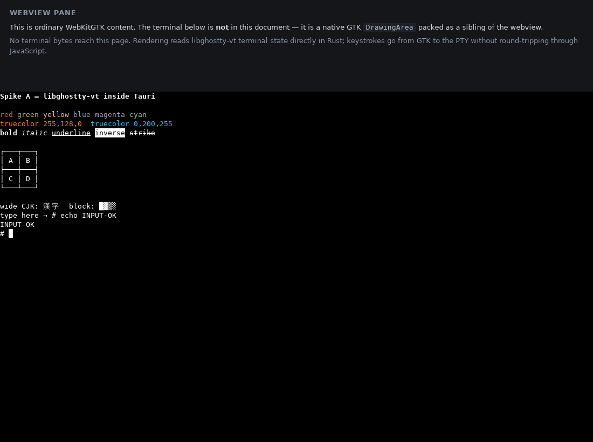
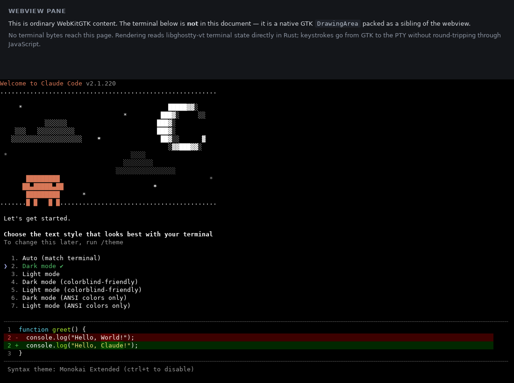

# Spike A — libghostty terminal embedding

**Status:** complete. libghostty renders a real interactive Claude Code session
inside a Tauri window on Linux, with input, resize, and raw-byte capture
working. One concrete libghostty limitation was found and it changes the
composition model; it does *not* rule libghostty out.

**Question asked:** can libghostty provide native terminal rendering and input
inside Tauri on macOS and Linux?

**Answer:** yes on Linux, via `libghostty-vt` plus a renderer we own. Ghostty's
own GPU renderer is not reachable from a Linux embedder — see
[Finding 1](#finding-1-the-gui-embedding-api-is-appkituikit-only). macOS should
be able to use Ghostty's renderer directly, but that path is unbuilt and
unverified here.



---

## 1. What libghostty actually ships

Ghostty builds **two different C libraries**, and the distinction decides the
whole spike. Both were read from the pinned source, not from documentation
about them.

| | `include/ghostty.h` | `include/ghostty/vt.h` |
|---|---|---|
| Name | the GUI embedding API | `libghostty-vt` |
| Contains | app, window, surface, GPU renderer, PTY, input | VT parser, terminal state, render state, input encoders |
| Platforms | **AppKit and UIKit only** | cross-platform |
| Build | `zig build` (default on macOS) | `zig build -Demit-lib-vt=true` |
| Used here | no — cannot | **yes** |

### Finding 1: the GUI embedding API is AppKit/UIKit only

This is the concrete, primary-source limitation that shapes everything below.

`ghostty_surface_config_s` carries a platform tag and a platform union. The
union has exactly two members:

```c
// include/ghostty.h
typedef struct { void* nsview; } ghostty_platform_macos_s;
typedef struct { void* uiview; } ghostty_platform_ios_s;
typedef union {
  ghostty_platform_macos_s macos;
  ghostty_platform_ios_s   ios;
} ghostty_platform_u;

typedef enum {
  GHOSTTY_PLATFORM_INVALID,
  GHOSTTY_PLATFORM_MACOS,
  GHOSTTY_PLATFORM_IOS,
} ghostty_platform_e;
```

There is no GTK, X11, Wayland, or Win32 variant. The Zig implementation
confirms it is not an oversight — on a non-Apple target the platform types are
`void` and construction fails:

```zig
// src/apprt/embedded.zig
pub const MacOS = if (builtin.target.os.tag.isDarwin()) struct {
    nsview: objc.Object,
} else void;

pub fn init(tag_int: c_int, c_platform: C) !Platform {
    return switch (tag) {
        .macos => if (MacOS != void) macos: { ... } else error.UnsupportedPlatform,
        .ios   => if (IOS   != void) ios:   { ... } else error.UnsupportedPlatform,
    };
}

pub const PlatformTag = enum(c_int) { macos = 1, ios = 2 };
```

Two more upstream statements agree:

```zig
// src/apprt/runtime.zig
/// Will not produce an executable at all when `zig build` is called.
/// This is only useful if you're only interested in the lib only (macOS).
none,
```

```zig
// build.zig
// This is NOT libghostty (even though its named that for historical
// reasons). It is just the glue between Ghostty GUI on macOS and
// the full Ghostty GUI core.
```

And the header itself: *"The only consumer of this API is the macOS app… This
isn't meant to be a general purpose embedding API (yet)."*

Ghostty on Linux does have a GTK4 UI, but it is an internal Zig `apprt`
(`src/apprt/gtk/`) compiled into Ghostty's own executable. It is not exposed
through any C entry point, so a third-party GTK application cannot host a
ghostty surface.

**Consequence:** on Linux, the plan's candidate model 1 (embed a ghostty
surface as a native child) and model 2 (drive ghostty's renderer offscreen)
are both impossible today, because neither the surface nor the renderer has a
Linux entry point. Model 3 — libghostty as terminal state with our own
renderer — is the only reachable one, and it is the one implemented.

### Finding 2: `libghostty-vt` is real, buildable, and sufficient

`libghostty-vt` builds cleanly on Linux and exports **280 symbols**. Everything
the contract needs is present:

| Need | libghostty-vt |
|---|---|
| Terminal state | `ghostty_terminal_new/free/reset/resize/vt_write` |
| Render surface | ✗ — no renderer; that is Finding 1 |
| Render *state* for a custom renderer | `ghostty_render_state_*`, row and cell iterators, dirty tracking |
| Keyboard input | `ghostty_key_encoder_*`, `ghostty_key_event_*` |
| Paste | `ghostty_paste_is_safe`; bracketed-paste framing is the caller's, gated on mode 2004 |
| Focus | `ghostty_focus_encode` |
| Mouse | `ghostty_mouse_encoder_*` |
| Resize / SIGWINCH | `ghostty_terminal_resize` for the grid; SIGWINCH is the host's `TIOCSWINSZ` |
| Raw PTY output | n/a — we own the PTY, so the tee is ours |
| PTY / process creation | ✗ — out of scope for the library, by design |
| GTK / AppKit integration | ✗ — deliberately none; it is a state library |

Upstream is explicit that this is pre-1.0:

> **WARNING:** This is an incomplete, work-in-progress API. It is not yet
> stable and is definitely going to change.

That is the main ongoing risk, and the reason the dependency is pinned to an
exact commit rather than a branch.

### Finding 3: there is no usable `libghostty-rs`

The brief named `libghostty-rs`. It does not exist as a published crate:

- `libghostty-rs` — not on crates.io (404 from the index).
- `ghostty` / `ghostty-rs` — not on crates.io.
- `libghostty` — **exists but is v0.1.0, yanked, published 2024-12-24, with
  zero dependencies.** A placeholder, not a binding.

So there is nothing to evaluate for maintenance or license. This spike binds
the C API directly with `bindgen`, generating from the installed headers at
build time. No signature is hand-written, so no API can be misremembered; if
upstream changes a signature the build breaks rather than miscompiling.

---

## 2. Composition model

**A native GTK `DrawingArea` packed as a sibling of the webview, drawn by our
own Cairo/Pango renderer from libghostty terminal state.**

```
GtkApplicationWindow                    (Tauri)
└─ GtkBox  ← window.default_vbox()
   ├─ WebKitWebView                     grid, session list, chrome
   └─ GtkDrawingArea                    terminal surface
        ├─ draw   → Cairo/Pango from Snapshot
        └─ keys   → TerminalInput → libghostty encoder → PTY
```

Sibling, not overlay. The plan flagged that an overlaid native surface "breaks
the moment the webview scrolls"; packing into the same `GtkBox` sidesteps
z-order, hit-testing, and scroll-sync entirely. The cost is the constraint the
plan predicted: **no webview UI may overlap the terminal** — no modals,
tooltips, or panels crossing that rectangle.

Two properties the brief asked for hold by construction:

- **Terminal bytes never reach React.** Rendering reads terminal state in Rust.
  The webview is not on the terminal's data path at all.
- **Raw PTY bytes are tee'd** to `TerminalEvent::Output` for Spike B's
  transcript capture, separately from rendering.

### Why Tauri forces GTK**3**

Tauri v2 on Linux is GTK3 + WebKitGTK 4.1 (`wry` → `webkit2gtk` → GTK3), even
though Ghostty's own Linux UI is GTK4. The terminal surface therefore has to be
a GTK3 widget. Mixing gtk4-rs into this process would produce two incompatible
GObject worlds. This is a Tauri constraint, not a libghostty one.

### What we gave up, and what we kept

Lost: Ghostty's GPU renderer, its font shaping and ligature handling, its
glyph atlas, and Kitty graphics rendering.

Kept — and this is the substance of the argument for libghostty over xterm.js:
Ghostty's VT parser and terminal model. Correct scrollback, reflow-on-resize,
wide-character and grapheme handling, and — demonstrated by test — protocol
state that a hand-rolled key map gets wrong. Once an application negotiates the
Kitty keyboard protocol, libghostty changes the encoding:

| Key | default | after `CSI > 1 u` |
|---|---|---|
| Escape | `\x1b` | `\x1b[27u` |
| Ctrl-C | `\x03` | `\x1b[99;5u` |
| `a` | `a` | `a` (unambiguous, correctly unchanged) |

Claude Code enables that protocol, so this is load-bearing, not trivia.

---

## 3. Layout

```
crates/ansible-terminal/        no Tauri, no GTK, no hub — builds standalone
  src/backend.rs                TerminalBackend contract
  src/event.rs                  typed input, resize, output events
  src/snapshot.rs               renderable frame (one allocation per frame)
  src/config.rs                 command, args, env, scrollback
  src/sys.rs                    bindgen output (generated, never hand-edited)
  src/vt/{terminal,render,keys} safe wrappers over libghostty-vt
  src/pty.rs                    PTY, spawn, SIGWINCH, exit status
  src/ghostty.rs                GhosttyTerminal: the contract, implemented
  examples/vt_fixture.rs        deterministic fixture, no GUI
  examples/vt_latency.rs        latency + throughput measurement
  tests/pty_matrix.rs           the verification matrix, on a real PTY

apps/desktop/src-tauri/         the harness
  src/surface.rs                GTK wiring, frame tick
  src/renderer.rs               Cairo/Pango renderer
  src/input.rs                  GDK key events → TerminalInput
```

`crates/ansible-terminal` depends on neither Tauri nor GTK, as the plan
requires, which is what makes `examples/vt-fixture` runnable with no display
server and keeps the renderer swappable.

### Contract changes

The `TerminalBackend` contract described in the brief was not present in the
repository (see [Provenance](#7-provenance)), so it was written here. Two parts
of its shape are dictated by what libghostty actually is, and are worth calling
out because they differ from what a "terminal backend" usually looks like:

- **`snapshot()` exists alongside `events()`.** Because libghostty gives us
  state rather than pixels, the renderer needs a state accessor. Rendering from
  the byte stream would throw away the entire reason to use libghostty.
- **`pump()` is explicit.** Callbacks fire synchronously inside
  `ghostty_terminal_vt_write`, and upstream forbids re-entering `vt_write` from
  a callback, so they enqueue and the host drains them on its own clock — a
  frame tick in the GUI, a poll loop in tests.

---

## 4. Verification

All 16 matrix tests run against a real PTY and a real child process, through
the full path: spawn → PTY → libghostty parse → render state → snapshot.

| Requirement | Result | Evidence |
|---|---|---|
| Normal text | pass | `normal_text_renders` |
| ANSI colors | pass | `ansi_palette_colors_render` |
| Truecolor | pass, exact RGB round trip | `truecolor_renders_exact_rgb` |
| Box drawing | pass | `box_drawing_characters_render`, screenshots |
| Streaming output | pass, ordered | `streaming_output_accumulates_in_order` |
| Keyboard + modifiers | pass | `keyboard_input_reaches_the_child`, encoder unit tests |
| Paste | pass | `paste_content_reaches_the_child` |
| Bracketed paste | pass, and correctly suppressed until mode 2004 | `bracketed_paste_is_framed_only_when_the_app_asks` |
| Ctrl-C | pass, shell survives and stays usable | `ctrl_c_interrupts_the_foreground_process` |
| Focus changes | pass, suppressed until mode 1004 | `focus_events_are_suppressed_until_requested` |
| Resize + SIGWINCH | pass, child observes new winsize | `resize_updates_the_grid_and_raises_sigwinch` |
| Process exit | pass, exit code surfaced | `process_exit_is_reported` |
| High-volume output | pass, 50k lines, terminal stays usable | `sustained_high_volume_output_stays_consistent` |
| Raw PTY tee | pass | `raw_output_is_tee_d_for_transcript_capture` |
| Alternate screen | pass, primary screen restored | `alternate_screen_applications_render_and_restore` |
| Wide glyphs / CJK | pass, no duplication | `wide_glyphs_occupy_two_cells_without_duplicating` |
| Real Claude Code session | pass | screenshot below |

54 unit tests cover the contract, snapshot model, VT wrappers, and key
encoding, including behavior only a real terminal library gets right (DSR
replies, DECCKM, Kitty protocol, mode tracking).

### Measurements

Release build, Linux x86_64, 120×40 grid.

**Input-to-glyph latency** — keystroke written to the PTY until the glyph is
readable in a snapshot. Covers PTY round trip, VT parse, render-state update,
and snapshot copy; excludes the Cairo paint.

| p50 | p90 | p99 | max |
|---|---|---|---|
| 1.71 ms | 1.93 ms | 2.20 ms | 3.25 ms |

200 samples, measured against `cat` in raw mode so the tty contributes no line
buffering.

**Sustained high-volume output**

| Lines | Bytes | Elapsed | Throughput | Dropped |
|---|---|---|---|---|
| 50,000 | 3.5 MiB | 0.34 s | 10.3 MiB/s | 0 |

Reproduce both with `cargo run --release -p ansible-terminal --example vt-latency`.

The latency figure is comfortably inside any interactive budget, and it is
measured on a headless VM with no GPU. Ghostty's renderer would not improve
these numbers; it would improve glyph quality.

### Real Claude Code session

`claude` v2.1.220 launched in the harness and rendered its full TUI — banner
art, palette and truecolor text, the theme picker with its selection marker,
and a syntax-highlighted diff with background-colored added/removed lines.



### Two defects this found, both fixed

- **The PTY child inherited no environment.** `portable_pty::CommandBuilder`
  starts empty, so the child had no `PATH` and `printf` was not found. Now
  seeded from the parent before config overrides.
- **`shutdown()` could hang forever.** It joined the reader thread, which can
  be parked in `read()` on the master fd — which killing the child does not
  wake. It now disconnects the channel and detaches.

### One deliberate trade-off

The raw-output tee is a bounded queue with a **non-blocking** send. If a
transcript consumer stops draining, bytes are dropped rather than stalling
rendering and input. Silent loss would be unacceptable for Spike B, so
undelivered bytes are counted and exposed as
`GhosttyTerminal::dropped_output_bytes()`; any non-zero value means the
transcript has a gap and is not byte-exact. An earlier blocking version was
tried and rejected: it let a slow consumer freeze the terminal.

**Spike B must treat `dropped_output_bytes() != 0` as a hard failure**, and
will likely want a spool rather than a queue.

---

## 5. Build and run

```bash
scripts/check-spike-a-prerequisites.sh   # what is missing, if anything
scripts/build-libghostty-vt.sh           # vendors Zig + builds libghostty-vt (~5 min)
scripts/run-spike-a.sh                   # harness with $SHELL
scripts/run-spike-a.sh claude            # harness with a real Claude Code session
xvfb-run -a scripts/run-spike-a.sh       # headless
```

No display server needed for the rest:

```bash
cargo run -p ansible-terminal --example vt-fixture            # deterministic fixture
cargo run --release -p ansible-terminal --example vt-latency  # measurements
cargo test --workspace                                        # 70 tests
```

The terminal command is configurable via `ANSIBLE_TERMINAL_COMMAND` and
`ANSIBLE_TERMINAL_ARGS`, defaulting to `$SHELL`, so the harness runs on machines
without Claude Code credentials.

Ubuntu 24.04 packages: `libgtk-3-dev libwebkit2gtk-4.1-dev libcairo2-dev
libpango1.0-dev libclang-dev` (plus `xvfb` for headless runs).

### Pinned versions

| Component | Pin |
|---|---|
| Ghostty | `a60cd15bb5a197d8e2596e86442031cbece06bcc` (2026-07-27, `1.3.2-dev`) |
| Ghostty license | MIT |
| `libghostty-vt` | `0.1.0-dev` from that revision |
| Zig | 0.16.0 (Ghostty's `minimum_zig_version`) |
| bindgen | 0.72.1 |
| portable-pty | 0.9.0 |
| crossbeam-channel | 0.5.16 |
| tauri | 2.11.5 (wry 0.55.1, webkit2gtk 2.0.2) |
| gtk / cairo-rs / pango / pangocairo | 0.18.2 / 0.18.5 / 0.18.3 / 0.18.0 |
| System GTK / WebKitGTK | 3.24.41 / 4.1 (2.52.3) |

Sources: <https://github.com/ghostty-org/ghostty> · `include/ghostty/vt.h` ·
`include/ghostty.h` · `src/apprt/embedded.zig` · `src/apprt/runtime.zig` ·
`build.zig` · `example/c-vt-render/`

`scripts/build-libghostty-vt.sh` pins the revision. It falls back to
`scripts/seed-zig-cache.sh` when Zig's package fetcher cannot reach the
dependency hosts through a proxy; that path downloads with curl/git and still
verifies every hash recorded in `build.zig.zon`.

---

## 6. Unresolved macOS work

None of this was built or run — no macOS host was available. It is the largest
remaining gap in Spike A.

1. **Decide which library macOS uses.** Unlike Linux, macOS *can* use the full
   GUI embedding API: `ghostty_surface_new` accepts an `NSView`, which is
   exactly what a Tauri `WKWebView` window can provide as a sibling. That would
   give Ghostty's GPU renderer, font shaping, and ligatures for free.
2. **Weigh that against one renderer or two.** Taking the AppKit path means
   macOS and Linux render by different code with different glyph output.
   Reusing the `libghostty-vt` path everywhere means one renderer and worse
   typography on macOS. Recommendation: **start with `libghostty-vt` on both**,
   since it is proven and keeps one code path, and revisit only if macOS
   typography is judged inadequate.
3. **Verify the sibling-view layout under AppKit**, including Retina scale
   factor changes and `NSView` focus interaction with the webview.
4. **IME.** Untested on both platforms. libghostty-vt exposes
   `ghostty_key_event_set_composing` and a preedit path exists in the GUI API,
   but nothing here exercises them. This is the most likely source of
   unpleasant surprises.
5. **Font fallback and ligatures** in the Cairo/Pango renderer — currently plain
   monospace with no ligature handling and no glyph atlas.

---

## 7. Provenance

The brief described this spike as continuing from commit `968ad57` ("Scaffold
libghostty terminal embedding spike"), said to have added
`crates/ansible-terminal`, the `TerminalBackend` contract, typed events,
`scripts/check-spike-a-prerequisites.sh`, and this document.

**That commit does not exist.** It is absent from the local object store, the
reflog, and the remote; the branch pointed at `631430e` (identical to `main`),
and the repository contained only `README.md` and `docs/plan/multiplayer-hub.md`.
Everything listed above was therefore written from scratch in this change,
guided by the module boundaries in the architecture plan.

The earlier environment notes were also inaccurate for this run: GitHub,
crates.io, and npm were all reachable, and GTK/WebKitGTK development packages
installed normally. The one real environment obstacle was that Zig's package
fetcher cannot negotiate this session's CONNECT proxy — an environment
limitation, not a libghostty one, and worked around in `seed-zig-cache.sh`
without weakening hash verification.

---

## 8. Recommendation

**Adopt libghostty-vt. Do not ship xterm.js.**

The kill criterion in the plan was latency and stability; neither was
approached. What the spike did find is narrower than the kill criterion and
does not trigger it: Ghostty's *renderer* is unavailable on Linux, so we write
the renderer. Ghostty's *terminal* — the part that is hard to get right and the
actual reason to prefer it over xterm.js — works.

Accept the constraint the plan anticipated: the session view's terminal region
is a native rectangle that webview UI must not overlap. Design around it.

Residual risks, in order:

1. **The vt API is pre-1.0 and will break.** Pinned to a commit; upgrades are
   deliberate. Mitigated by bindgen (breakage is a compile error) and by 70
   tests.
2. **Renderer quality is ours to own** — font fallback, ligatures, and
   eventually Kitty graphics, none of which Cairo/Pango gives for free.
3. **macOS is unverified.** See section 6.
4. **IME is untested.**
